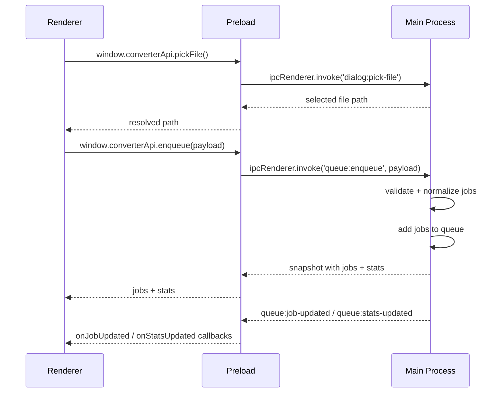

# Image Converter (Electron Shell)

Initial desktop app shell for an image converter built with Electron + Node.js.

This version includes:
- Secure Electron architecture (main/preload/renderer separation)
- Restricted IPC bridge via `contextBridge`
- Conversion job queue in the main process
- Real-time queue/job updates in the renderer
- Basic UI for source selection, output options, and progress display

It is intentionally a foundation build. The conversion pipeline now runs in a worker thread and is ready for more codecs/libraries to be plugged in.

## Current Status

Implemented now:
- Select a single file or a folder
- Configure output format and bit depth (UI-level selection)
- Enter output directory path
- Queue jobs and process them sequentially
- Convert files in a worker thread using `sharp`, with HEIC/HEIF decode support via `heic-convert`
- Expand folders recursively and enqueue one job per supported image file
- Auto-detect source image type before conversion
- See real-time per-job progress and aggregate stats
- Cancel queued (not yet running) jobs
- Auto-create output directory during processing

Not implemented yet:
- Metadata preservation controls
- Retry policy for failed conversions
- Advanced output presets for each codec

## Tech Stack

- Electron (main/preload/renderer)
- Node.js runtime for queue/process orchestration
- Plain HTML/CSS/JS renderer for the shell UI

## Project Structure

```text
.
├─ package.json
├─ src/
│  ├─ main/
│  │  ├─ main.js        # App window + IPC handlers
│  │  └─ jobQueue.js    # Conversion queue service
│  ├─ preload/
│  │  └─ preload.js     # Secure API bridge for renderer
│  └─ renderer/
│     ├─ index.html     # UI shell
│     ├─ renderer.js    # UI logic + IPC consumption
│     └─ styles.css     # UI styling
└─ .github/
   └─ agents/
      └─ electron-image-converter.agent.md
```

## Security Model

The app uses Electron security best practices in this shell:
- `contextIsolation: true`
- `nodeIntegration: false`
- `sandbox: true`
- Renderer only accesses approved capabilities exposed in preload

Renderer code cannot import Node APIs directly.

## IPC Contract

Exposed by preload (`window.converterApi`):
- `pickFile()`
- `pickFolder()`
- `enqueue(payload)`
- `getSnapshot()`
- `cancelJob(jobId)`
- `subscribe({ onJobUpdated, onStatsUpdated })`

Main-process channels handled:
- `dialog:pick-file`
- `dialog:pick-folder`
- `queue:enqueue`
- `queue:get-snapshot`
- `queue:cancel-job`
- `queue:subscribe`

## IPC Flow

The app keeps all privileged work in the main process and exposes only a narrow API to the renderer through preload.



Flow summary:
- Renderer requests actions only through `window.converterApi`.
- Preload translates those requests into IPC calls and filters the responses it exposes back to the page.
- Main process owns dialogs, queue state, validation, and all privileged filesystem work.
- Main process pushes realtime job/status updates back to the renderer so the UI can render progress without direct Node access.

## Queue Behavior

Queue service characteristics:
- In-memory FIFO queue
- Sequential worker loop (one active job at a time)
- Per-job lifecycle states:
  - `queued`
  - `processing`
  - `completed`
  - `failed`
  - `cancelled`
- Stage markers used for UI progress:
  - `queued`
  - `preparing`
  - `reading`
  - `decoding`
  - `encoding`
  - `writing`
  - `done`
  - `failed`
  - `cancelled`

Aggregate stats tracked:
- `total`
- `queued`
- `processing`
- `completed`
- `failed`
- `cancelled`

## Getting Started

### Prerequisites

- Node.js 18+ recommended
- npm 9+
- Windows/macOS/Linux supported by Electron

### Install

```bash
npm install
```

### Run

```bash
npm start
```

## Development Notes

- Conversion work runs in `src/main/conversionWorker.js` on a worker thread.
- Folder selections are expanded recursively in the main process.
- Folder mode can preserve relative subdirectories or flatten everything into one output folder.
- Source type detection is based on file signatures and extension fallback.
- Output directory creation is performed with `fs.mkdir(..., { recursive: true })`.
- Each supported image file becomes its own queued job.

## Next Milestones

1. Add real conversion backend:
   - metadata preservation controls
   - retry policy for failed conversions
2. Add per-job conversion metrics:
   - input/output size
   - duration
   - compression ratio

## Troubleshooting

If Electron does not start:
- Verify install: `npm ls electron`
- Reinstall dependencies: `npm install`
- Check terminal output for missing native prerequisites

If queue appears idle:
- Confirm a source path is selected
- Confirm output directory is set
- Check job status and error text in the queue list
